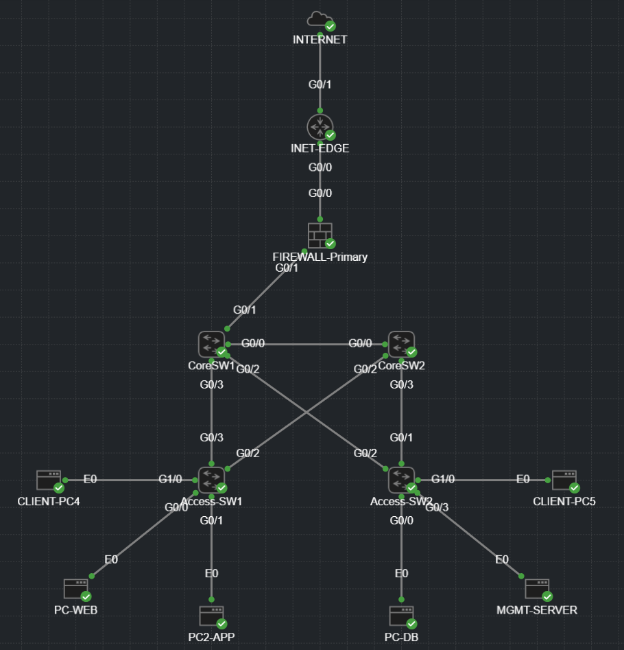

# Network-Lab/Zero-Trust

Zero Trust network architecture, built at home from scratch.  
Each lab is a step toward designing networks at the scale of Fortune 500 enterprises.  
All work is documented with configurations, diagrams, and crisis scenarios.

---

## Hybrid Enterprise Architecture — Zero Trust Security Lab

Scenario: A simulated Fortune 500 hybrid OSPF/Zero Trust network.  
Goal: Build and test a segmented enterprise network with firewalls, core routing, DHCP/DNS services, and end-to-end policy enforcement.  

---

## Skills Demonstrated

- Zero Trust segmentation: deny by default, controlled inter-zone access  
- Firewall enforcement: ACLs, NAT, and inspection  
- DNS/DHCP resilience: foundational infrastructure  
- OSPF and Policy-Based Routing (PBR): advanced routing to enforce inspection  
- Operational visibility: syslog, ACL counters, NAT debugging  

---

## Devices Used

- **ASA Firewall (ASAv):** Cisco Adaptive Security Virtual Appliance (primary enforcement point)  
- **Edge Router (IOSv):** Cisco IOSv Virtual Router Platform (Internet edge)  
- **Core Switching (IOSvL2):** Cisco IOSv-L2 Virtual Switch Platform (dual-core backbone with OSPF + VLAN trunks)  
- **Access Switching (IOSvL2):** Segmentation for User, Web, App, DB, Mgmt VLANs  
- **Servers (Alpine Linux):**  
  - Web Server (Nginx, reverse proxy to App)  
  - App Server (Flask API, connects to DB)  
  - Database Server (Postgres, bookings schema)  
  - Management Server (DNS, syslog)  
- **Clients (Alpine Linux):** Test endpoints for User zone  
- **External Connector:** Provides simulated Internet access  

---

## Architecture

- Hybrid Design: OSPF for internal routing, Zero Trust for user traffic  
- Security Zones: Five-tier model (User, Web, App, DB, Mgmt)  
- Advanced Routing: PBR ensures all flows are inspected before forwarding  
- Enterprise Scale: Dual-core switch design with ASA firewall at enforcement points  
- Visibility: syslog monitoring, ACL hit-counts, NAT translation tracking  

---

## Crisis Scenarios (Planned)

1. Asymmetric Routing Nightmare  
2. Security Zone Bypass  
3. TCP MSS Black Hole  
4. PBR Loop of Death  
5. DHCP Amplification  

Documented but not yet implemented. These scenarios will be added as the lab develops.

---

## Why This Lab Matters

This lab is built on the belief that the network is the first line of cyber defense.  
Every configuration, ACL, and NAT rule is intentional.  

This is not just practice — it is preparation for designing real enterprise networks.
